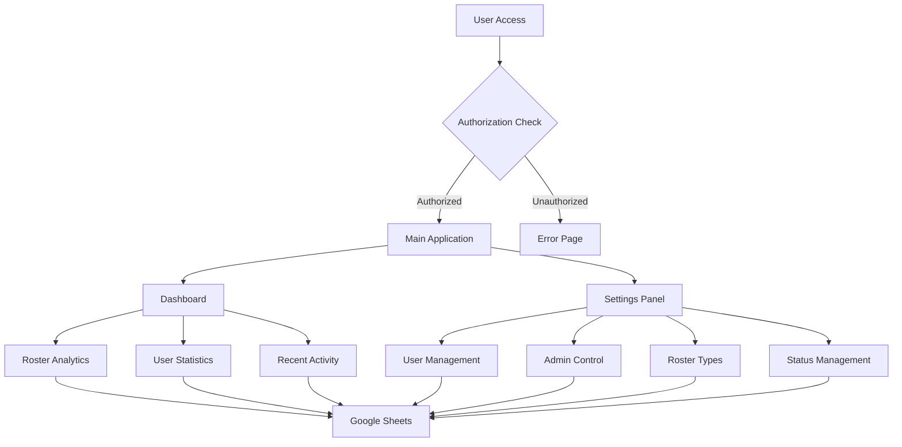

<div align="center">
  
</div>

<div align="center">
  
</div>

<p align="center">
  
  
  
  
  <a href="https://www.tiktok.com/@backpacktechworks/video/7527550387755289857?is_from_webapp=1&sender_device=pc&web_id=7452295003038156306" target="_blank">
    
  </a>


</p>

---

## Overview

The **Roster System** is a comprehensive Google Apps Script web application designed for modern staff roster management. Built by **Backpack Software House**, this free and open-source starter kit provides teams with powerful tools to manage rosters, users, and settings through an intuitive, responsive interface.

<div align="center">

| Feature | Description | Status |
|---------|-------------|--------|
| **Dashboard Analytics** | Visual overview with key metrics | Complete |
| **User Management** | Comprehensive access control | Complete |
| **Roster Management** | Full CRUD operations | Complete |
| **Settings Control** | Admin panel for configuration | Complete |
| **Responsive Design** | Mobile-first interface | Optimized |
| **Google Integration** | Seamless Sheets connectivity | Active |
| **Access Control** | Role-based permissions | Secure |
| **Modern UI** | Custom theming system | Beautiful |

</div>

---

## Quick Start

<details>
<summary><b>Prerequisites</b></summary>

- Google account with Apps Script access
- Google Sheets for data storage
- Basic understanding of web applications
- Admin privileges for initial setup

</details>

<details>
<summary><b>Installation Steps</b></summary>

**1. Create Google Apps Script Project**
```bash
# Navigate to Google Apps Script
https://script.google.com
# Create new project
# Copy all project files
```

**2. Set up Google Sheets Structure**
```bash
# Create sheets with these tabs:
- Settings
- Rosters  
- Users Rosters
- Raw dashboard
```

**3. Configure Project Manifest**
```json
{
  "timeZone": "Asia/Singapore",
  "dependencies": {
    "enabledAdvancedServices": [
      {
        "userSymbol": "Calendar",
        "version": "v3",
        "serviceId": "calendar"
      }
    ]
  },
  "exceptionLogging": "STACKDRIVER",
  "runtimeVersion": "V8",
  "webapp": {
    "executeAs": "USER_ACCESSING",
    "access": "ANYONE"
  }
}
```

**4. Deploy as Web Application**
```bash
# Deploy > New deployment
# Type: Web app
# Execute as: User accessing the web app
# Access: Anyone
```

</details>

---

## System Architecture

<div align="center">



</div>

### Core Components Structure

<details>
<summary><b>Application Layer</b></summary>

| Component | Purpose | Key Features |
|-----------|---------|--------------|
| **RoosterApp.html** | Main interface | Responsive layout, navigation, theming |
| **Rooster App.js** | Core logic | HTTP handling, CRUD operations, access control |
| **Unauthorized.html** | Error handling | Professional error page for unauthorized access |

</details>

<details>
<summary><b>Dashboard System</b></summary>

| Component | Purpose | Key Features |
|-----------|---------|--------------|
| **CRUDDashboard.html** | Analytics interface | Metrics cards, recent activity, user stats |
| **CRUD Dashboard.js** | Dashboard logic | Data processing, statistics calculation |

</details>

<details>
<summary><b>Settings Management</b></summary>

| Component | Purpose | Key Features |
|-----------|---------|--------------|
| **CRUDSettings.html** | Admin interface | User management, roster configuration |
| **CRUD Settings.js** | Settings logic | Admin operations, data validation |

</details>

<details>
<summary><b>Data Layer</b></summary>

| Sheet | Purpose | Key Fields |
|-------|---------|------------|
| **Settings** | User access control | email, role, permissions, status |
| **Rosters** | Roster definitions | name, type, status, assignments |
| **Users Rosters** | User assignments | user_id, roster_id, role, dates |
| **Raw dashboard** | Analytics data | metrics, counts, activity logs |

</details>

### Security & Access Control

<div align="center">

| Feature | Implementation | Benefit |
|---------|---------------|---------|
| **Email Verification** | Settings sheet validation | Prevents unauthorized access |
| **Role-based Access** | Admin/User permissions | Granular control |
| **Session Management** | Google OAuth integration | Secure authentication |
| **Error Handling** | Graceful failure modes | Professional user experience |

</div>

---

## Feature Showcase

<div align="center">

### Dashboard Analytics

</div>

<table align="center">
<tr>
<td>

**Key Metrics**
- Monthly roster count
- Total assignments
- Active users
- System utilization

</td>
<td>

**Recent Activity**
- Latest roster updates
- User assignments
- Status changes
- System events

</td>
</tr>
<tr>
<td>

**User Statistics**
- Assignment distribution
- Role breakdown
- Activity patterns
- Performance metrics

</td>
<td>

**Visual Analytics**
- Card-based layout
- Color-coded status
- Responsive design
- Real-time updates

</td>
</tr>
</table>

### Settings Management

<div align="center">

**Comprehensive administrative control panel**

</div>

<table align="center">
<tr>
<th>User Management</th>
<th>System Configuration</th>
<th>Roster Control</th>
</tr>
<tr>
<td>

- **Add/Remove Users**
- **Admin Privileges**
- **Access Control**
- **Role Assignment**
- **Status Management**

</td>
<td>

- **Roster Types**
- **Status Categories**
- **Staff Shifts**
- **System Settings**
- **Data Validation**

</td>
<td>

- **Create Rosters**
- **Assign Users**
- **Update Status**
- **Bulk Operations**
- **History Tracking**

</td>
</tr>
</table>

---

## Code Examples

### Core Functionality

<details>
<summary><b>User Authentication</b></summary>

```javascript
function checkUserAccess() {
  try {
    const userEmail = Session.getActiveUser().getEmail();
    const settingsSheet = SpreadsheetApp.getActiveSpreadsheet()
      .getSheetByName('Settings');
    
    const data = settingsSheet.getDataRange().getValues();
    const userRow = data.find(row => row[0] === userEmail);
    
    return {
      hasAccess: !!userRow,
      isAdmin: userRow && userRow[1] === 'Admin',
      userInfo: userRow
    };
  } catch (error) {
    console.error('Access check failed:', error);
    return { hasAccess: false, isAdmin: false };
  }
}
```

</details>

<details>
<summary><b>Dashboard Data Processing</b></summary>

```javascript
function getDashboardMetrics() {
  try {
    const sheets = {
      rosters: SpreadsheetApp.getActiveSpreadsheet().getSheetByName('Rosters'),
      users: SpreadsheetApp.getActiveSpreadsheet().getSheetByName('Users Rosters'),
      dashboard: SpreadsheetApp.getActiveSpreadsheet().getSheetByName('Raw dashboard')
    };
    
    const currentMonth = new Date().getMonth();
    const rostersData = sheets.rosters.getDataRange().getValues();
    
    return {
      monthlyRosters: rostersData.filter(row => 
        new Date(row[2]).getMonth() === currentMonth
      ).length,
      totalAssignments: sheets.users.getLastRow() - 1,
      activeUsers: new Set(sheets.users.getRange('A:A').getValues().flat()).size,
      recentActivity: getRecentActivity(sheets.dashboard)
    };
  } catch (error) {
    console.error('Dashboard metrics failed:', error);
    return {};
  }
}
```

</details>

<details>
<summary><b>CRUD Operations</b></summary>

```javascript
function createRoster(rosterData) {
  try {
    const sheet = SpreadsheetApp.getActiveSpreadsheet()
      .getSheetByName('Rosters');
    
    const newRow = [
      rosterData.name,
      rosterData.type,
      rosterData.status,
      new Date(),
      Session.getActiveUser().getEmail()
    ];
    
    sheet.appendRow(newRow);
    
    return {
      success: true,
      message: 'Roster created successfully',
      rosterId: sheet.getLastRow()
    };
  } catch (error) {
    console.error('Create roster failed:', error);
    return {
      success: false,
      message: 'Failed to create roster'
    };
  }
}
```

</details>

<details>
<summary><b>Batch Operations</b></summary>

```javascript
function batchUpdateRosters(updates) {
  try {
    const sheet = SpreadsheetApp.getActiveSpreadsheet()
      .getSheetByName('Rosters');
    
    updates.forEach(update => {
      const range = sheet.getRange(update.row, update.column);
      range.setValue(update.value);
    });
    
    return {
      success: true,
      updated: updates.length,
      timestamp: new Date()
    };
  } catch (error) {
    console.error('Batch update failed:', error);
    return { success: false, error: error.message };
  }
}
```

</details>

---

## Customization Guide

### Color Theme System

The application uses a sophisticated color palette that can be customized:

```css
:root {
  --dark-teal: #001219;    /* Primary dark backgrounds */
  --teal: #005F73;         /* Navigation and headers */
  --turquoise: #0A9396;    /* Interactive elements */
  --light-teal: #94D2BD;   /* Subtle backgrounds */
  --cream: #E9D8A6;        /* Content backgrounds */
  --orange: #EE9B00;       /* Warning states */
  --burnt-orange: #CA6702; /* Active states */
  --rust: #BB3E03;         /* Error states */
  --red: #AE2012;          /* Critical alerts */
  --dark-red: #9B2226;     /* Danger zones */
}
```

### Adding New Features

<details>
<summary><b>Custom Dashboard Widgets</b></summary>

```javascript
function addCustomWidget(widgetConfig) {
  const widget = {
    title: widgetConfig.title,
    data: widgetConfig.dataSource(),
    template: widgetConfig.template,
    refreshInterval: widgetConfig.refresh || 300000
  };
  
  // Add to dashboard rendering
  return widget;
}
```

</details>

<details>
<summary><b>New Settings Categories</b></summary>

```javascript
function addSettingsCategory(category) {
  const settingsConfig = {
    name: category.name,
    fields: category.fields,
    validation: category.validation,
    permissions: category.permissions
  };
  
  // Register with settings system
  return settingsConfig;
}
```

</details>

### Performance Optimization

```javascript
// Batch operations for better performance
function optimizedDataFetch() {
  const sheets = SpreadsheetApp.getActiveSpreadsheet().getSheets();
  const data = {};
  
  sheets.forEach(sheet => {
    data[sheet.getName()] = sheet.getDataRange().getValues();
  });
  
  return data;
}

// Caching for frequently accessed data
const cache = CacheService.getScriptCache();

function getCachedData(key, fetchFunction, ttl = 300) {
  let data = cache.get(key);
  
  if (!data) {
    data = JSON.stringify(fetchFunction());
    cache.put(key, data, ttl);
  }
  
  return JSON.parse(data);
}
```

---

## Deployment & Maintenance

### Production Deployment

<div align="center">

**Step-by-step deployment process**

</div>

<table align="center">
<tr>
<td align="center">

**Preparation**
- Code review complete
- Testing finished
- Documentation updated
- Backup created

</td>
<td align="center">

**Deployment**
- Apps Script project ready
- Sheets structure verified
- Permissions configured
- Web app deployed

</td>
</tr>
<tr>
<td align="center">

**Verification**
- Access control tested
- All features functional
- Performance acceptable
- Error handling working

</td>
<td align="center">

**Monitoring**
- User feedback collected
- Performance metrics tracked
- Error logs monitored
- Updates planned

</td>
</tr>
</table>

### Maintenance Tasks

```javascript
// Regular maintenance functions
function performMaintenance() {
  // Clean old logs
  cleanupLogs();
  
  // Optimize sheets
  optimizeSheetStructure();
  
  // Update cache
  refreshSystemCache();
  
  // Generate reports
  generateMaintenanceReport();
}

function cleanupLogs() {
  const logSheet = SpreadsheetApp.getActiveSpreadsheet()
    .getSheetByName('System Logs');
  
  const cutoffDate = new Date();
  cutoffDate.setDate(cutoffDate.getDate() - 30);
  
  // Remove logs older than 30 days
  const data = logSheet.getDataRange().getValues();
  const filteredData = data.filter(row => 
    new Date(row[0]) > cutoffDate
  );
  
  logSheet.clear();
  logSheet.getRange(1, 1, filteredData.length, filteredData[0].length)
    .setValues(filteredData);
}
```

---

## Troubleshooting

### Common Issues & Solutions

<details>
<summary><b>Access Denied Errors</b></summary>

**Problem**: Users cannot access the application

**Solutions**:
- Verify user email in Settings sheet
- Check deployment permissions
- Confirm OAuth scopes
- Review sharing settings

```javascript
// Debug access issues
function debugUserAccess(userEmail) {
  const settingsSheet = SpreadsheetApp.getActiveSpreadsheet()
    .getSheetByName('Settings');
  
  const users = settingsSheet.getDataRange().getValues();
  const userFound = users.find(row => row[0] === userEmail);
  
  console.log('User lookup result:', {
    email: userEmail,
    found: !!userFound,
    details: userFound
  });
}
```

</details>

<details>
<summary><b>Performance Issues</b></summary>

**Problem**: Slow loading or timeouts

**Solutions**:
- Implement data caching
- Optimize sheet queries
- Reduce data transfer
- Use batch operations

```javascript
// Performance monitoring
function monitorPerformance() {
  const startTime = new Date();
  
  // Your operation here
  performOperation();
  
  const endTime = new Date();
  const duration = endTime - startTime;
  
  console.log(`Operation took \${duration}ms`);
  
  if (duration > 5000) {
    console.warn('Performance issue detected');
  }
}
```

</details>

<details>
<summary><b>Data Synchronization</b></summary>

**Problem**: Data inconsistencies between sheets

**Solutions**:
- Implement data validation
- Add referential integrity checks
- Use transaction-like operations
- Regular data audits

```javascript
// Data integrity check
function validateDataIntegrity() {
  const issues = [];
  
  // Check for orphaned records
  const rosters = getRosterIds();
  const assignments = getAssignmentRosterIds();
  
  assignments.forEach(id => {
    if (!rosters.includes(id)) {
      issues.push(`Orphaned assignment for roster \${id}`);
    }
  });
  
  return issues;
}
```

</details>

---

## Contributing

<div align="center">

**Join our community of contributors!**

</div>

<table align="center">
<tr>
<td align="center">

**Report Issues**
Found a bug or have suggestions?
Create detailed issue reports

</td>
<td align="center">

**Contribute Code**
Fork, develop, and submit PRs
Follow our coding standards

</td>
<td align="center">

**Improve Docs**
Help make documentation better
Add examples and tutorials

</td>
<td align="center">

**Share Ideas**
Propose new features
Join community discussions

</td>
</tr>
</table>

### Development Workflow

```bash
# 1. Fork the repository
git clone https://github.com/yourusername/rooster-system.git
cd rooster-system

# 2. Create feature branch
git checkout -b feature/amazing-feature

# 3. Make changes and test
# Test in Google Apps Script environment
# Verify all functionality works

# 4. Commit with clear messages
git add .
git commit -m "feat: add user bulk import functionality"

# 5. Push and create pull request
git push origin feature/amazing-feature
```

### Code Standards

- **JavaScript Style**: Use ES6+ features, consistent naming
- **HTML Structure**: Semantic markup, accessibility considerations  
- **CSS Organization**: Custom properties, responsive design
- **Documentation**: Clear comments, updated README
- **Testing**: Thorough testing in Apps Script environment

---

## About Backpack

<div align="center">

**Modern software house dedicated to accessible, beautiful, and practical tools**

</div>

<table align="center">
<tr>
<td align="center">

**Our Mission**
Building tools that empower teams
and make work more efficient

</td>
<td align="center">

**Our Values**
Open source, community-driven
accessible to everyone

</td>
<td align="center">

**Our Team**
Passionate developers creating
solutions that matter

</td>
<td align="center">

**Our Commitment**
Free, high-quality tools
for the global community

</td>
</tr>
</table>


### Development Team

<div align="center">
  <table>
    <tr>
      <td align="center">
        <br>
        <strong>Lead Developer</strong><br>
        <a href="https://github.com/Darkguyaiman">@Darkguyaiman</a>
      </td>
      <td align="center">
        <br>
        <strong>Co-Developer</strong><br>
        <a href="https://github.com/Ak-ko">@Ak-ko</a>
      </td>
    </tr>
  </table>
</div>

<div align="center">

*Crafted with care for the community.*

</div>


---


**Need Help?**

- Check our documentation
- Browse existing issues
- Create new issue reports
- Join community discussions

</div>

---

<div align="center">
  
</div>

<div align="center">

**Star this repository if you find it useful!**

*Built with care by Backpack Software House*
</div>
